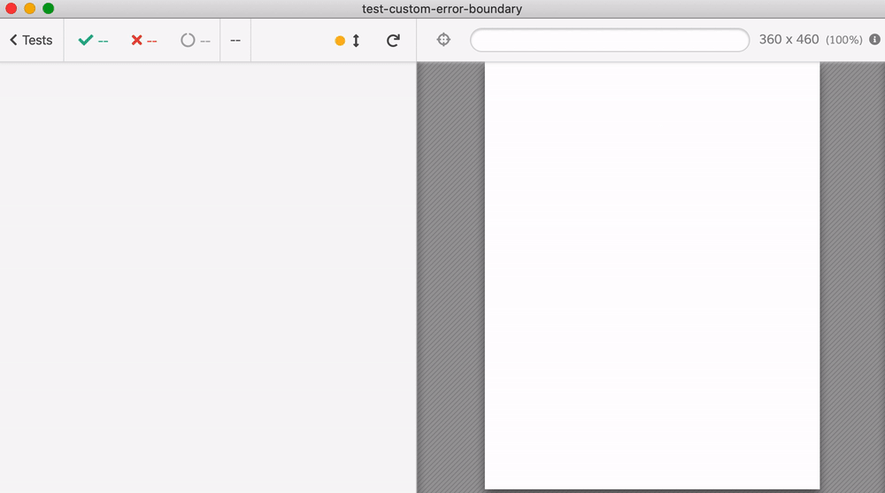
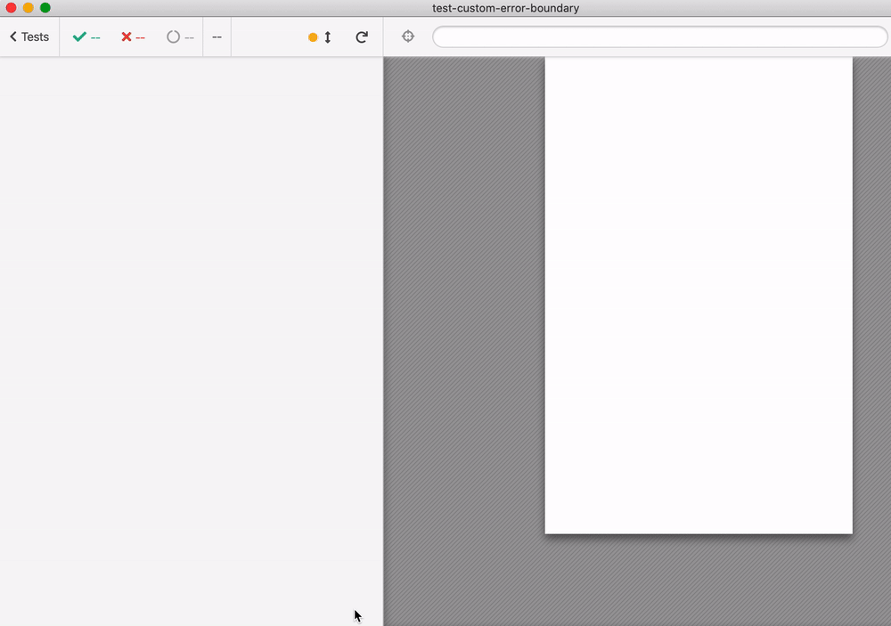
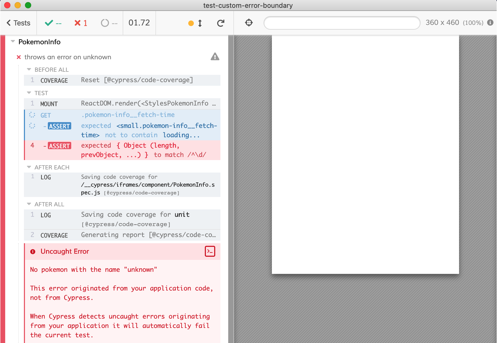
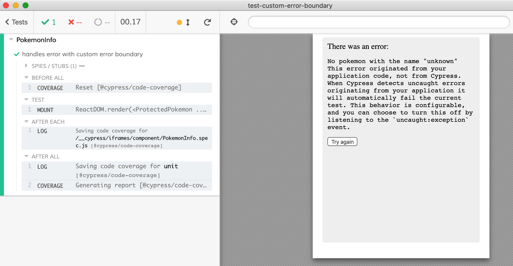
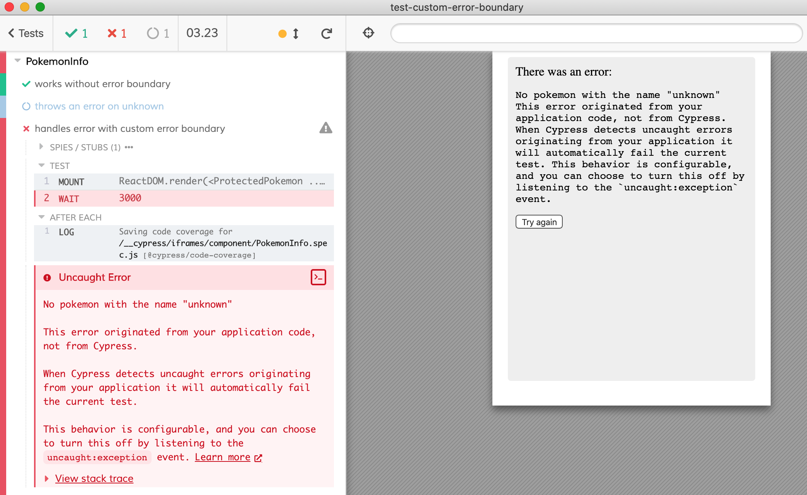
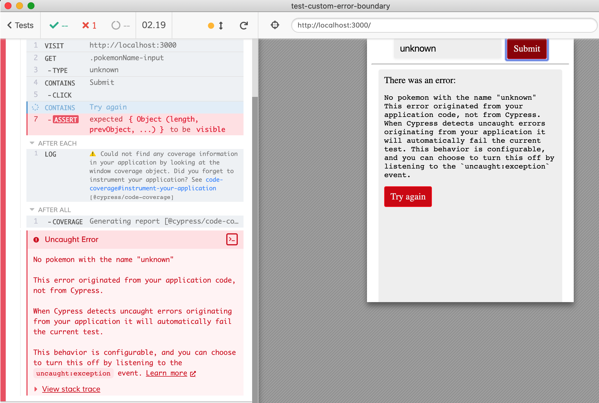

# Custom error boundary example

Downloaded from [codesandbox](https://codesandbox.io/s/throbbing-thunder-67cnp) from [tweet](https://twitter.com/kentcdodds/status/1255981305218469888)

```shell
npm i -D cypress cypress-react-unit-test
```

Set [cypress/plugins/index.js](cypress/plugins/index.js), [cypress/support/index.js](cypress/support/index.js) and [cypress.json](cypress.json) files following [cypress-react-unit-test README](https://github.com/bahmutov/cypress-react-unit-test).

Tests in [src/PokemonInfo.spec.js](src/PokemonInfo.spec.js) and in [src/App.spec.js](src/App.spec.js)





Trying to fetch unknown pokemon leads to a broken test



## Run

After installing dependencies, to run integration tests `yarn run dev`. To run component tests just need `yarn cypress open`.

## Observations

- ~~Initially `react-scripts@3.4.1` did not include webpack?! Had to drop-down to `react-scripts@3.3.1`~~ Seems like a fluke, re-installing and I can find it

```
$ npm ls webpack
react-codesandbox@0.1.0 /Users/gleb/git/test-custom-error-boundary
└─┬ react-scripts@3.4.1
  └── webpack@4.42.0
```

- I think because of transient dependencies, the user could get an error when doing `react-scripts start`, which looks scary and requires `.env` file with `SKIP_PREFLIGHT_CHECK=true`. [#157](https://github.com/bahmutov/cypress-react-unit-test/issues/157)
- `index.js` included `ReactDOM.render(<App />, document.getElementById('root'))` which just generated a cryptic error. Had to refactor the app to get around (or comment it out) [#158](https://github.com/bahmutov/cypress-react-unit-test/issues/158)
- if the user forgets to include `cypress-react-unit-test/support` from the support file, the error is cryptic [#159](https://github.com/bahmutov/cypress-react-unit-test/issues/159)
- custom error boundary works, seems to be in Cypress core



**BUT**

We can click the "try again" button ourselves and it triggers the stub, but if we try to wait or do any command from the test, it fails the test

```js
const pokemonName = 'unknown'
const onReset = cy.stub().as('reset')
const ProtectedPokemon = () => (
  <div className="pokemon-info">
    <AppErrorBoundary onReset={onReset} keys={[pokemonName]}>
      <PokemonInfo pokemonName={pokemonName} />
    </AppErrorBoundary>
  </div>
)
mount(<ProtectedPokemon />)
// it catches the error
cy.wait(3000)
```



^^ Note: this is a bug, and it happens even during e2e test in [cypress/integration/spec.js](cypress/integration/spec.js). Opened [#7196](https://github.com/cypress-io/cypress/issues/7196)



